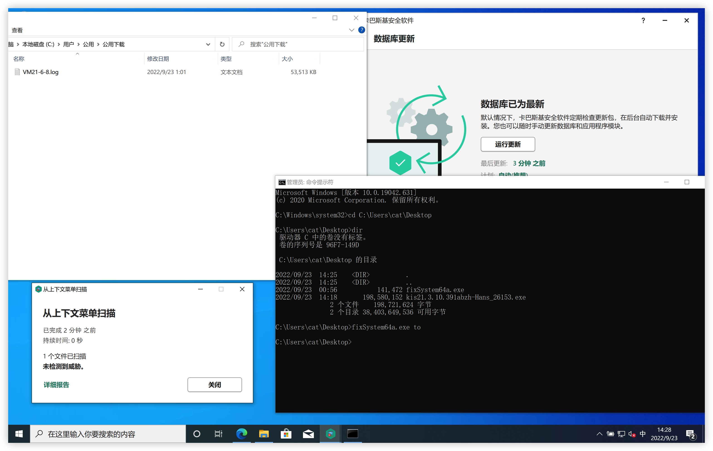

# CallBackDump
能过卡巴、defender等杀软的dump lsass进程工具，参考代码链接在下面。

由minidumpCallback实现，对缓冲区中内存做了些修改后再写入磁盘，同时做了一些小细节修改。

需要注意的是别扔云沙箱，这工具也没有任何网络行为。

# 环境

VS2022

# 用法

`CallbackDump.exe to` 将lsass进程dump成VM21-6-8.log

`dumpXor.exe VM21-6-8.log 1.bin` 将加密的进程文件解密

# 参考链接

https://www.ired.team/offensive-security/credential-access-and-credential-dumping/dumping-lsass-passwords-without-mimikatz-minidumpwritedump-av-signature-bypass
